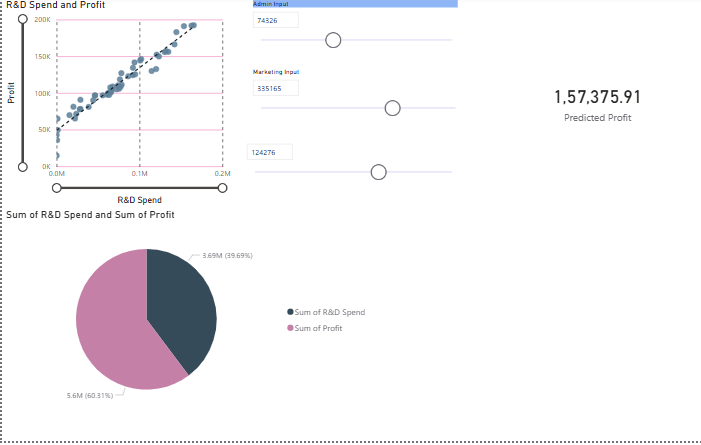

# startup-profit-analysis-powerbi
Power BI project analyzing startup profitability
# Startup Profit Analysis (Power BI)

## 📊 Project Overview
This project analyzes startup data to identify key factors affecting profitability using Power BI and regression analysis.

## 🎯 Objectives
- Identify key drivers of profit
- Analyze R&D, Marketing, and Administration impact
- Build a predictive model

## 🛠 Tools Used
- Power BI
- Excel
- SQL (for preprocessing)

## 📈 Key Insights
- R&D Spend has the highest impact on profit
- Marketing Spend shows moderate correlation
- Administration has minimal effect

## 📊 Dashboard Features
- Interactive filters
- What-if analysis
- KPI cards for profit tracking

## 📂 Dataset
Dataset contains startup financial data including:
- R&D Spend
- Marketing Spend
- Administration
- Profit

## 🚀 Outcome
Built a regression model with R² = 0.95 to predict startup profitability.

## 📸 Dashboard Preview

